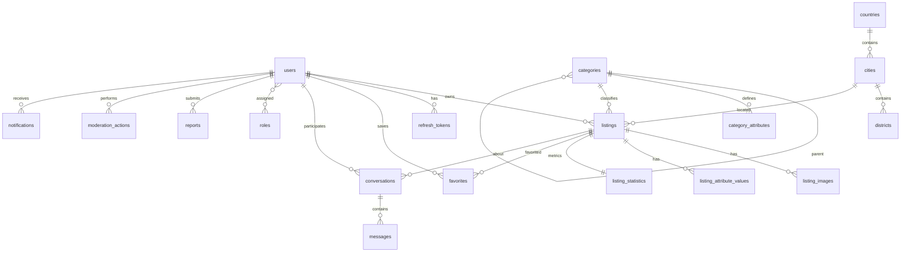

# Phase 1 — Technical Design (Phase 0.5)

**Document:** PHASE_1_TECHNICAL_DESIGN.md  
**Version:** 1.1  
**Status:** Approved (2026-07-27)  
**Date:** 2026-07-27  
**Prerequisite:** Phase 0 complete (environment verified, repository on GitHub)

---

## Purpose

This document is the **implementation blueprint for Phase 1**. It defines scope, build order, data model, API contracts, backend modules, frontend/admin surfaces, validation, security, testing, and seed data.

**No application code is written in Phase 0.5.** Phase 1 implementation begins only after explicit approval of this document.

### Source documents reviewed

| Document | Role |
|----------|------|
| [PRODUCT_REQUIREMENTS.md](./PRODUCT_REQUIREMENTS.md) | Business behavior (source of truth) |
| [SYSTEM_ARCHITECTURE.md](./SYSTEM_ARCHITECTURE.md) | Architecture principles and stack |
| [DATABASE.md](./DATABASE.md) | Data model |
| [API_SPEC.md](./API_SPEC.md) | HTTP contract |
| [UI_GUIDELINES.md](./UI_GUIDELINES.md) | UX standards |
| [CURSOR_RULES.md](./CURSOR_RULES.md) | Engineering rules |
| [ADR-001](./adr/001-authentication-jwt-refresh.md) through [ADR-006](./adr/006-file-storage-and-media.md) | Accepted technical decisions |

### Current codebase baseline (Phase 0D)

| Layer | State |
|-------|-------|
| Backend | Laravel 12 scaffold; `/api/v1/health`; `ApiResponse` envelope; `ApiExceptionHandler`; DDD folders empty; default `User` model only |
| Frontend | next-intl shell (`/ar`, `/en`); placeholder `HomeShell`; no API client or auth |
| Admin | Placeholder dashboard + disabled login; no API client or auth |
| Shared | API envelope types/schemas, pagination, locales, promotion constants — not yet imported by apps |
| Database | Default Laravel migrations only (`users`, `cache`, `jobs`) |
| Auth packages | None installed |

---

## 1. Phase 1 scope

### 1.1 In scope (Phase 1 — MVP Core Marketplace)

Phase 1 delivers a **functional bilingual marketplace** where verified users can publish listings, buyers can search and contact sellers, and moderators can review content.

| # | Module | Summary |
|---|--------|---------|
| 1 | **Authentication** | Register, login, logout, refresh, forgot/reset password, phone OTP, email verification |
| 2 | **User accounts & profiles** | Profile CRUD, avatar upload, password change, account deletion, public profile |
| 3 | **Roles & permissions (RBAC)** | Roles, permissions, middleware, policies; admin/moderator access |
| 4 | **Locations** | Countries, cities, districts (Qatar launch seed) |
| 5 | **Categories** | Hierarchy, translations, dynamic attributes; public read; admin CRUD |
| 6 | **Listings** | Full lifecycle (draft → moderation → published → pause/sold/expired/archive) |
| 7 | **Listing attributes** | Dynamic attribute values per category |
| 8 | **Listing images** | Upload, reorder, delete; MinIO storage; async processing |
| 9 | **Search & filtering** | PostgreSQL FTS; suggestions; popular searches; category/location/price filters |
| 10 | **Favorites** | Add/remove/list favourites |
| 11 | **Messaging** | Conversations, text messages, read status, archive, block, report; polling transport |
| 12 | **Reports** | User-submitted reports (listing, user, message); admin queue |
| 13 | **Admin moderation** | Pending listing queue, approve/reject/block; user suspend/block; report resolution |
| 14 | **Notifications** | In-app + email for Phase 1 critical events (see §14) |
| 15 | **Platform settings** | Configurable rules (listing duration, moderation defaults, limits) |
| 16 | **Audit logging** | Moderation and security-sensitive actions |
| 17 | **Frontend (public)** | Auth flows, browse, search, listing detail, create/edit listing, favourites, messages, profile |
| 18 | **Admin dashboard** | Login, moderation queues, category management, user management, reports |
| 19 | **Shared contracts** | Zod schemas and TypeScript types for all Phase 1 API payloads |
| 20 | **Seed data** | Qatar locations, category tree, roles/permissions, platform settings, demo users |

### 1.2 Explicitly out of scope (deferred)

Aligned with README approved deferrals and PRD post-MVP items:

| Item | Reason | Target |
|------|--------|--------|
| Saved searches & search history | ADR-005, API_SPEC Post-MVP | Phase 2+ |
| Listing video upload | ADR-006 | Post-MVP Core |
| Automated duplicate detection | README deferral | Phase 2+ (manual moderation only) |
| Moderation appeals | DATABASE.md reserved | Post-MVP Core |
| Advanced promotion types | Launch = featured only | Phase 2 (payments) |
| **Business accounts** | Not in Phase 1 user request; large vertical | Phase 2 |
| **Reviews & ratings** | Depends on completed transactions/messaging maturity | Phase 2 |
| **Payments & Stripe** | Featured promotions require payments module | Phase 2 |
| **Subscriptions & packages** | Payments dependency | Phase 2 |
| **Analytics dashboard** | Basic counts in admin overview only | Phase 2+ |
| Push notifications (FCM/APNs) | Architecture defers beyond MVP Core | Phase 3+ |
| Production SMS OTP vendor | Provider abstraction only in Phase 1; no vendor integrated | Pre-launch (GCC provider via interface) |
| WebSockets / SSE messaging | ADR-004 polling for MVP | Phase 13+ |
| Meilisearch | ADR-005 Phase 2 | When volume warrants |
| Identity document verification (`user_verifications`) | Beyond phone/email for MVP Core | Phase 2+ |

### 1.3 Phase 1 success criteria

Phase 1 is complete when:

1. A user can register, verify phone, log in, and manage a profile.
2. An admin can seed/manage categories with dynamic attributes.
3. A verified user can create a listing with images, submit for moderation, and manage lifecycle states.
4. A guest can search, filter, and view published listings.
5. An authenticated user can favourite listings and message sellers.
6. A moderator can approve/reject listings and resolve reports.
7. All Phase 1 API endpoints return the unified envelope; RBAC enforced server-side.
8. Frontend works in Arabic (RTL) and English (LTR).
9. Admin dashboard performs moderation workflows.
10. Automated tests cover critical auth, listing, search, and moderation paths.
11. Seed data enables local demo without manual DB setup.

---

## 2. Implementation order

Build in dependency order. Each sub-phase is a reviewable milestone; **stop for approval between sub-phases if requested**.

```
Phase 1A  Foundation & RBAC
    ↓
Phase 1B  Authentication & sessions
    ↓
Phase 1C  User profiles & avatars
    ↓
Phase 1D  Locations & categories
    ↓
Phase 1E  Listings core (no images)
    ↓
Phase 1F  Listing images & MinIO
    ↓
Phase 1G  Search & filtering
    ↓
Phase 1H  Favorites
    ↓
Phase 1I  Messaging
    ↓
Phase 1J  Reports & moderation
    ↓
Phase 1K  Notifications
    ↓
Phase 1L  Frontend (public app)
    ↓
Phase 1M  Admin dashboard
    ↓
Phase 1N  Integration testing & hardening
```

### Sub-phase detail

| Sub-phase | Backend | Frontend | Admin | Tests |
|-----------|---------|----------|-------|-------|
| **1A** | Migrations (foundation tables), RBAC seed, `platform_settings`, audit log infra, JWT package, base middleware | Shared: auth types/schemas | — | RBAC unit tests |
| **1B** | Auth module: register, login, logout, refresh, OTP, email verify, password reset | — | — | Auth feature tests |
| **1C** | Profile endpoints, avatar upload job | — | — | Profile tests |
| **1D** | Category CRUD (admin), public read, attribute management, location seed | — | Category admin UI (minimal) | Category tests |
| **1E** | Listing CRUD, lifecycle state machine, attribute values, policies | — | — | Listing lifecycle tests |
| **1F** | Image upload, reorder, delete, processing queue | — | — | Image upload tests |
| **1G** | FTS indexes, search service, suggestions, popular | — | — | Search tests |
| **1H** | Favorites endpoints | — | — | Favorite tests |
| **1I** | Conversations, messages, blocks, polling params | — | — | Messaging tests |
| **1J** | Reports, moderation actions, admin listing/user endpoints | Moderation queue UI | Moderation UI | Moderation tests |
| **1K** | Notification model, email jobs, in-app feed | — | — | Notification tests |
| **1L** | — | All public pages & flows | — | E2E (optional) |
| **1M** | — | — | Full admin workflows | Admin flow tests |
| **1N** | Rate limits, security review, performance indexes | Polish, empty/error states | Polish | Full regression |

**Parallelization note:** Frontend (1L) can begin after 1B (auth client) and proceed incrementally as APIs land (categories at 1D, listings at 1E, etc.). Admin (1M) can begin after 1B + 1J APIs exist.

---

## 3. Architecture overview

### 3.1 Backend module layout (Clean Architecture)

```
backend/app/
├── Domain/
│   ├── Auth/           # Value objects: TokenPair, OtpCode; enums: AccountStatus
│   ├── User/           # User entity behaviors, VerificationLevel
│   ├── Category/       # Category tree rules, AttributeType enum
│   ├── Listing/        # ListingStatus enum, state transitions, PriceType
│   ├── Messaging/      # Conversation rules, MessageType
│   ├── Moderation/     # ReportStatus, ModerationActionType
│   └── Shared/         # Domain exceptions, UUID trait contract
├── Application/
│   ├── Auth/           # RegisterUser, LoginUser, RefreshToken, VerifyPhone, ...
│   ├── User/           # UpdateProfile, UploadAvatar, DeleteAccount, ...
│   ├── Category/       # CreateCategory, GetCategoryTree, ...
│   ├── Listing/        # CreateListing, SubmitListing, ApproveListing, ...
│   ├── Search/         # SearchListings, GetSuggestions, ...
│   ├── Favorite/       # ToggleFavorite, ListFavorites
│   ├── Messaging/      # StartConversation, SendMessage, MarkRead, ...
│   ├── Moderation/     # CreateReport, ResolveReport, ModerateListing, ...
│   └── Notification/   # SendNotification, MarkRead, ...
├── Infrastructure/
│   ├── Persistence/    # Eloquent repositories implementing domain interfaces
│   ├── Auth/           # JwtService, RefreshTokenRepository, OtpService
│   ├── Storage/        # S3StorageAdapter, ImageProcessor
│   ├── Search/         # PostgresFtsSearchRepository
│   ├── Notification/   # MailNotificationChannel, DatabaseNotificationChannel
│   └── Cache/          # Redis cache wrappers
└── Http/
    ├── Controllers/Api/V1/
    ├── Middleware/     # AuthenticateJwt, EnsurePhoneVerified, EnsureRole, ...
    ├── Requests/       # Form requests per endpoint
    ├── Resources/      # JsonResource transformers
    └── Policies/       # ListingPolicy, ConversationPolicy, ...
```

**Convention:** Controllers are thin — validate request → dispatch Application action → return Resource via `ApiResponse`.

### 3.2 JWT authentication package

**Decision (recommended):** `php-open-source-saver/jwt-auth` (maintained JWT fork) **plus** custom refresh token table per ADR-001.

| Token | Lifetime | Storage |
|-------|----------|---------|
| Access token | **15 minutes** | Client memory only |
| Refresh token | **14 days** (configurable via `JWT_REFRESH_TTL_DAYS`) | Hashed in `refresh_tokens` table; **httpOnly Secure SameSite=Strict cookie** |

Rationale: Bearer access tokens for API calls; refresh token in httpOnly cookie reduces XSS exfiltration risk.

**Approved (2026-07-27):**

- Access token stored in **client memory only** — never in `localStorage` or `sessionStorage`
- Refresh token in **Secure, httpOnly** cookie with appropriate **SameSite** (Strict/Lax) and **CSRF** protection for cookie-authenticated refresh
- Silent session restore via `POST /auth/refresh` on page load (Phase 1B)
- Install `php-open-source-saver/jwt-auth` **only after** verifying Laravel 12 + PHP 8.4 compatibility (including `ext-sodium`); if incompatible, stop and report — do not substitute another package automatically

### 3.3 Frontend architecture

```
frontend/src/
├── app/[locale]/           # App Router pages (locale prefix)
├── components/
│   ├── ui/                 # Button, Input, Card, Modal, Badge, ...
│   └── features/           # ListingCard, SearchBar, MessageThread, ...
├── features/               # Feature modules
│   ├── auth/
│   ├── listings/
│   ├── search/
│   ├── favorites/
│   ├── messaging/
│   └── profile/
├── lib/
│   ├── api-client.ts       # fetch wrapper, envelope parsing, token refresh
│   ├── auth-store.ts       # Zustand: user, tokens (access in memory)
│   └── query-client.ts     # TanStack Query defaults
├── hooks/
└── i18n/                   # existing next-intl setup
```

Forms: React Hook Form + Zod (schemas from `@tamam/shared` where possible).

### 3.4 Admin architecture

Same patterns as frontend; English-only for Phase 1 (admin i18n deferred). Authenticates against same API with moderator/admin permissions.

---

## 4. Authentication and user accounts

### 4.1 Registration flow

```
Client                          API                           Services
  │ POST /auth/register           │                             │
  ├──────────────────────────────►│ Validate input              │
  │                               │ Create user (status=pending)│
  │                               │ Assign role: user           │
  │                               │ Hash password               │
  │                               │ Send phone OTP ────────────►│ OtpService (Redis)
  │                               │ Send email verify link ────►│ Queue: email job
  │◄──────────────────────────────┤ Return 201 + user summary   │
  │                               │ (no tokens until phone OK)  │
```

**Post-registration:** User must verify phone before receiving full tokens OR tokens issued but `phone_verified_at` gate blocks listing publish (recommended: issue tokens after register for UX, gate publish on phone verification).

### 4.2 Login flow

```
POST /auth/login { email|phone, password }
  → Validate credentials
  → Check account status (blocked/suspended/deleted → 403 with reason code)
  → Rate limit (5 attempts / 15 min per IP+identifier)
  → Issue access JWT + refresh token (rotate on refresh)
  → Update last_login
  → Return TokenPair + UserResource
```

Login accepts **email + password** OR **phone (E.164) + password**.

### 4.3 Phone verification (OTP)

| Rule | Value |
|------|-------|
| OTP length | 6 digits |
| Expiry | 5 minutes |
| Max attempts | 5 per OTP |
| Resend cooldown | 60 seconds |
| Storage | Redis key `otp:phone:{hash}` with hashed OTP value |
| Dev mode | `LogOtpProvider` writes OTP to a dedicated local log channel only |

**Approved OTP policy:**

- **No production SMS vendor** in Phase 1 — use a **provider abstraction** (`OtpProviderInterface`) so a GCC SMS provider can be connected later
- Development driver logs OTP securely in the local environment only
- **Never return OTP values in API responses**

### 4.4 Email verification

- Signed URL with expiry (60 minutes) via Laravel notifications
- Required for business accounts (Phase 2); **optional but encouraged** for regular users in Phase 1
- `email_verified_at` nullable until verified

### 4.5 Password reset

Standard Laravel-style token in `password_reset_tokens` table (already in default migration) OR dedicated flow:

```
POST /auth/forgot-password { email }
POST /auth/reset-password { email, token, password, password_confirmation }
  → Revoke ALL refresh tokens for user
```

### 4.6 Session revocation triggers

Revoke all refresh tokens when:

- Password changed or reset
- Email changed (initiated)
- Phone changed (initiated)
- Account blocked, suspended, deleted
- Admin force-revoke (Phase 1: via user block endpoint)

Logout revokes **current** refresh token only.

### 4.7 Account statuses

| Status | Can login | Can publish | Can message |
|--------|-----------|-------------|-------------|
| `pending` | Yes | No | Yes (read-only inbox) |
| `active` | Yes | If phone verified | Yes |
| `suspended` | Yes (limited) | No | Read existing only |
| `blocked` | No | No | No |
| `deleted` | No | No | No |

### 4.8 User model (Phase 1 fields)

Extend default `users` migration:

| Column | Type | Notes |
|--------|------|-------|
| id | UUID PK | Replace auto-increment |
| full_name | string(100) | Replace `name` |
| username | string(30) unique nullable | Set during onboarding or profile edit |
| email | string unique | |
| phone | string(20) unique | E.164 normalized (+974...) |
| password | string | bcrypt |
| avatar | string nullable | S3 URL |
| bio | text nullable | max 500 chars |
| language | enum ar,en | default `ar` |
| country_id | FK nullable | |
| city_id | FK nullable | |
| account_type | enum individual | business deferred Phase 2 |
| verification_level | enum none, phone, email, trusted | |
| status | enum | see §4.7 |
| phone_verified_at | timestamp nullable | |
| email_verified_at | timestamp nullable | |
| trusted_seller | boolean default false | Enables auto-publish when setting allows |
| last_login_at | timestamp nullable | |
| timestamps + soft delete | | |

### 4.9 Auth API endpoints

| Method | Path | Auth | Description |
|--------|------|------|-------------|
| POST | `/auth/register` | No | Register |
| POST | `/auth/login` | No | Login |
| POST | `/auth/logout` | Yes | Revoke current refresh |
| POST | `/auth/refresh` | Refresh cookie | Rotate tokens |
| POST | `/auth/forgot-password` | No | Send reset email |
| POST | `/auth/reset-password` | No | Reset password |
| POST | `/auth/verify-phone` | Yes | Submit OTP |
| POST | `/auth/resend-phone-code` | Yes | Resend OTP |
| POST | `/auth/verify-email` | No | Verify email token |
| GET | `/auth/me` | Yes | Lightweight session check |

Rate limits:

| Endpoint group | Limit |
|----------------|-------|
| `/auth/register`, `/auth/login` | 5/min per IP |
| `/auth/forgot-password` | 3/hour per email |
| `/auth/resend-phone-code` | 3/hour per user |
| `/auth/verify-phone` | 10/min per user |

---

## 5. User roles and permissions

### 5.1 Role model

**Decision:** `guest` is **not** a database role — it represents unauthenticated requests. Database roles:

| Role slug | Description |
|-----------|-------------|
| `user` | Default registered user |
| `verified_user` | Phone verified (can be computed from `phone_verified_at` rather than separate role — **recommended**) |
| `moderator` | Content moderation |
| `admin` | Platform administration |
| `super_admin` | Full access including role management |

**Recommendation:** Use **permission checks** for capabilities; use `phone_verified_at` gate instead of `verified_user` role to avoid sync issues. Assign `user` role on registration; elevate to `moderator`/`admin`/`super_admin` via admin only.

**Conflict resolution:** SYSTEM_ARCHITECTURE lists `Support` role — **defer to Phase 2**; not in PRD user roles.

### 5.2 Permission groups (Phase 1 minimum)

| Group | Permissions |
|-------|-------------|
| **users** | `users.view`, `users.suspend`, `users.block`, `users.delete`, `users.verify` |
| **listings** | `listings.view`, `listings.moderate`, `listings.block`, `listings.delete` |
| **categories** | `categories.view`, `categories.manage` |
| **reports** | `reports.view`, `reports.assign`, `reports.resolve` |
| **moderation** | `moderation.actions.view` |
| **settings** | `settings.view`, `settings.manage` |
| **audit** | `audit.view` |
| **roles** | `roles.manage` (super_admin only) |

### 5.3 Role → permission matrix

| Permission | user | moderator | admin | super_admin |
|------------|------|-----------|-------|-------------|
| users.view | — | ✓ | ✓ | ✓ |
| users.suspend/block | — | — | ✓ | ✓ |
| listings.moderate | — | ✓ | ✓ | ✓ |
| categories.manage | — | — | ✓ | ✓ |
| reports.* | — | ✓ | ✓ | ✓ |
| settings.manage | — | — | ✓ | ✓ |
| roles.manage | — | — | — | ✓ |

Regular users have **no admin permissions** — authorization for own resources via **policies** (owner checks).

### 5.4 Middleware

| Middleware | Purpose |
|------------|---------|
| `auth:jwt` | Valid access token required |
| `EnsurePhoneVerified` | Blocks listing create/submit |
| `EnsureAccountActive` | Blocks suspended/blocked/deleted |
| `Permission:{slug}` | RBAC for admin routes |
| `ThrottleApi` | Rate limiting |

### 5.5 Policies (Phase 1)

| Policy | Rules |
|--------|-------|
| `ListingPolicy` | view: published OR owner OR moderator; create/update/delete: owner + phone verified; moderate: moderator+ |
| `ConversationPolicy` | view/send: participant only; block: participant |
| `CategoryPolicy` | view: public; manage: admin+ |
| `UserPolicy` | update: self; view public profile: anyone; admin actions: admin+ |
| `ReportPolicy` | create: authenticated; view queue: moderator+ |

---

## 6. Categories and subcategories

### 6.1 Data model

Per DATABASE.md with Phase 1 constraints:

| Table | Purpose |
|-------|---------|
| `categories` | Tree via `parent_id`; max depth **3 levels** (configurable in `platform_settings`) |
| `category_translations` | `ar`, `en` names |
| `category_attributes` | Dynamic fields per leaf or branch category |
| `category_attribute_translations` | Localized labels |
| `category_attribute_options` | Dropdown/radio/multi-select values |
| `category_attribute_option_translations` | Localized option labels |

### 6.2 Category rules

- Every **listing** attaches to exactly one **leaf category** (no listings on parent-only categories)
- Status: `active`, `hidden`, `archived`
- Hidden: not selectable for new listings; existing listings remain
- Archived: read-only historical link
- `listing_count` cached; updated on listing publish/unpublish/delete
- Slug unique globally

### 6.3 Attribute types (Phase 1)

Implement all types from DATABASE.md:

`text`, `long_text`, `number`, `price`, `dropdown`, `radio`, `checkbox`, `boolean`, `date`, `multi_select`

Each attribute flags: `required`, `searchable`, `filterable`, `sort_order`, `unit`, `min_value`, `max_value`, `validation_rules` (JSON).

### 6.4 Category API

| Method | Path | Auth | Description |
|--------|------|------|-------------|
| GET | `/categories` | No | Flat list (active only) |
| GET | `/categories/tree` | No | Nested tree with translations |
| GET | `/categories/{id}` | No | Single category |
| GET | `/categories/{id}/attributes` | No | Attributes + options for listing form |
| POST | `/admin/categories` | Admin | Create |
| PUT | `/admin/categories/{id}` | Admin | Update |
| DELETE | `/admin/categories/{id}` | Admin | Soft delete if no active listings |
| POST | `/admin/categories/{id}/attributes` | Admin | Create attribute |
| PUT | `/admin/category-attributes/{id}` | Admin | Update attribute |

**Locale:** Pass `Accept-Language: ar|en` or `?locale=ar` for translated names.

---

## 7. Listings and listing lifecycle

### 7.1 State machine

```
                    ┌──────────┐
                    │  draft   │
                    └────┬─────┘
                         │ submit
                         ▼
                 ┌───────────────┐     reject      ┌──────────┐
                 │ pending_review│──────────────►│ rejected │
                 └───────┬───────┘               └────┬─────┘
                         │ approve                    │ resubmit
                         ▼                            │
                  ┌────────────┐◄────────────────────┘
                  │ published  │
                  └───┬───┬────┘
          pause       │   │      mark_sold
             ▼        │   ▼         ▼
        ┌────────┐    │ ┌──────┐  ┌──────┐
        │ paused │    │ │ sold │  │expired│ (scheduler)
        └────┬───┘    │ └──┬───┘  └──┬───┘
             │activate │    │         │ renew
             └────────►│    │         ▼
                       │    │    ┌─────────┐
                       │    └───►│ archived│
                       │         └─────────┘
                       │
              admin block ▼
                  ┌─────────┐
                  │ blocked │
                  └─────────┘

Any state ──soft delete──► deleted
```

### 7.2 Listing fields

| Column | Type | Notes |
|--------|------|-------|
| id | UUID | |
| user_id | FK | Owner |
| category_id | FK | Leaf category |
| city_id | FK | |
| district_id | FK nullable | |
| title | string(120) | |
| slug | string | **Globally unique**; short random suffix appended on collision; **not** the database primary key |
| description | text | 50–5000 chars, plain text |
| price | decimal(12,2) nullable | Null for contact_for_price |
| price_type | enum | fixed, negotiable, free, contact_for_price |
| currency | char(3) | default QAR |
| condition | enum nullable | new, used, refurbished |
| status | enum | see state machine |
| rejection_reason | string nullable | User-visible on reject |
| moderation_notes | text nullable | Internal only |
| latitude/longitude | decimal nullable | Not public unless owner opts in |
| contact_preferences | json | `{ in_app: true, phone: false, whatsapp: false, email: false }` |
| featured | boolean | Denormalized from active promotion (Phase 2); default false |
| expires_at | timestamp nullable | Set on publish |
| published_at | timestamp nullable | |
| sold_at | timestamp nullable | |
| timestamps + soft delete | | |

### 7.3 Listing rules

| Rule | Value |
|------|-------|
| Phone verification | Required to create/submit |
| Default duration | 30 days from publish (`platform_settings.default_listing_duration_days`) |
| Max active listings per user | 10 default (`platform_settings.max_active_listings_user`) |
| New user moderation | Manual review required (`platform_settings.require_manual_moderation_for_new_users = true`) |
| Trusted seller auto-publish | When `trusted_seller=true` AND setting enabled |
| Min images to submit | 1 |
| Max images | 20 |
| Title | 10–120 chars |
| Description | 50–5000 chars |
| Significant edit | Configurable via `platform_settings.remoderate_on_significant_edit`; when enabled, changes to **significant fields** on a **published** listing return it to `pending_review` |

**Significant fields (approved):** `title`, `description`, `category_id`, `price`, `price_type`, and **any listing image change** (upload, delete, or reorder).

### 7.4 Listing API endpoints

| Method | Path | Auth | Description |
|--------|------|------|-------------|
| GET | `/listings` | No | Browse with filters (see §8) |
| GET | `/listings/{id}` | No | Detail (published or owner) |
| GET | `/listings/featured` | No | Featured listings (empty until Phase 2 payments) |
| GET | `/listings/latest` | No | Recent published |
| GET | `/listings/{id}/similar` | No | Same category, same city |
| POST | `/listings` | User+phone | Create draft |
| PUT | `/listings/{id}` | Owner | Update |
| DELETE | `/listings/{id}` | Owner/Admin | Soft delete |
| POST | `/listings/{id}/submit` | Owner | Submit for review |
| POST | `/listings/{id}/pause` | Owner | Pause |
| POST | `/listings/{id}/activate` | Owner | Reactivate paused |
| POST | `/listings/{id}/mark-sold` | Owner | Mark sold |
| POST | `/listings/{id}/renew` | Owner | Renew expired |
| POST | `/listings/{id}/archive` | Owner | Archive |
| POST | `/listings/{id}/restore` | Owner | Restore archived |
| GET | `/users/me/listings` | User | Owner's listings (all statuses) |
| GET | `/users/me/listings/{id}/statistics` | Owner | View counts (Phase 1 basic) |

### 7.5 Listing attribute values

Stored in `listing_attribute_values` with typed columns per DATABASE.md. Validated server-side against category attribute definitions on create/update/submit.

---

## 8. Search and filtering

### 8.1 Strategy (ADR-005)

PostgreSQL Full Text Search on `listings.title` and `listings.description`.

### 8.2 FTS implementation

```sql
-- Generated column or trigger-maintained tsvector
ALTER TABLE listings ADD COLUMN search_vector tsvector;

-- Index
CREATE INDEX listings_search_vector_idx ON listings USING GIN (search_vector);

-- Arabic + English: use 'simple' config for MVP (Arabic stemming deferred)
-- Phase 1.1 improvement: dual vectors or 'arabic' + 'english' configs
```

**Query service:** `SearchListingsAction` builds dynamic SQL with:

- FTS rank on keyword
- Filters: category_id (include descendants), city_id, district_id, price_min/max, price_type, condition, attribute filters
- Status filter: `published` only for public
- Sort: relevance (default), newest, oldest, price_asc, price_desc, most_viewed
- Pagination: default 20, max 100

### 8.3 Endpoints

| Method | Path | Description |
|--------|------|-------------|
| GET | `/search` | Global search (primary) |
| GET | `/search/suggestions` | Autocomplete (title prefix + category names) |
| GET | `/search/popular` | Cached popular terms (Redis, seeded) |

**Clarification:** `GET /listings` supports basic filters for browse pages; `GET /search` is keyword-focused. Both use shared query builder internally.

| Parameter | Type | Notes |
|-----------|------|-------|
| keyword | string | Optional for /listings; primary for /search |
| category_id | uuid | Includes subcategories |
| city_id | uuid | |
| district_id | uuid | |
| price_min, price_max | number | |
| price_type | enum | |
| condition | enum | |
| sort | enum | |
| page, per_page | int | |
| attr[{slug}] | mixed | Dynamic attribute filters |

---

## 9. Favorites

### 9.1 Rules

- Authenticated only
- Unique (user_id, listing_id)
- Cannot favorite own listing
- Cannot favorite non-published listings (except owner preview — no)
- Soft-deleted listings excluded from favorites list
- Favorite count aggregated in `listing_statistics.favorites_count`

### 9.2 Endpoints

| Method | Path | Description |
|--------|------|-------------|
| GET | `/users/me/favorites` | Paginated list |
| POST | `/listings/{id}/favorite` | Add |
| DELETE | `/listings/{id}/favorite` | Remove |

---

## 10. Messaging

### 10.1 Transport (ADR-004)

- **Polling** for MVP
- Message fetch supports `?since_id={uuid}` and/or `?since={iso8601}` for incremental loads
- Recommended poll interval: 5–10s (open thread), 30–60s (inbox)

### 10.2 Conversation rules

- One conversation per (listing_id, buyer_id) pair — reuse existing if present
- Buyer cannot message own listing (403)
- Seller = listing owner
- New conversations blocked when listing status in: `sold`, `expired`, `blocked`, `deleted`, `archived`
- Existing conversations remain readable with system status message

### 10.3 Message types (Phase 1)

| Type | Description |
|------|-------------|
| `text` | Plain text, max 2000 chars |
| `system` | Listing status changes, block notices |
| `listing_reference` | Reserved for future rich cards |

Image/location/document messages deferred.

### 10.4 Block and archive

- **Archive:** per-participant (`buyer_archived_at`, `seller_archived_at`)
- **Block:** sets `blocked_by_user_id`; blocked party cannot send; system message inserted
- **User blocks:** `user_blocks` table for global block across conversations

### 10.5 Endpoints

| Method | Path | Description |
|--------|------|-------------|
| GET | `/conversations` | Inbox (paginated) |
| POST | `/conversations` | Start `{ listing_id, message? }` |
| GET | `/conversations/{id}` | Detail + participants |
| GET | `/conversations/{id}/messages` | Messages (paginated, since_id) |
| POST | `/conversations/{id}/messages` | Send text |
| POST | `/conversations/{id}/read` | Mark read |
| POST | `/conversations/{id}/archive` | Archive for current user |
| POST | `/conversations/{id}/block` | Block other party |
| POST | `/conversations/{id}/report` | Creates report entity |

---

## 11. Admin moderation

### 11.1 Listing moderation queue

```
GET /admin/listings?status=pending_review&sort=oldest
POST /admin/listings/{id}/approve   → status=published, set expires_at, notify owner
POST /admin/listings/{id}/reject    → status=rejected, rejection_reason required
POST /admin/listings/{id}/block     → status=blocked
DELETE /admin/listings/{id}         → soft delete (admin)
```

Each action creates `moderation_actions` audit row.

### 11.2 User management

```
GET /admin/users?status&search=
PUT /admin/users/{id}/suspend       → status=suspended
PUT /admin/users/{id}/block         → status=blocked, revoke tokens
PUT /admin/users/{id}/verify        → trusted_seller=true (manual trust)
```

**Note:** API_SPEC uses `/ban` — standardize on `/block` per PRD terminology.

### 11.3 Reports

```
POST /reports                        → user creates
GET /admin/reports?status=new        → queue
GET /admin/reports/{id}
POST /admin/reports/{id}/assign
POST /admin/reports/{id}/resolve     → resolution + optional moderation action
POST /admin/reports/{id}/escalate
```

### 11.4 Admin dashboard overview

```
GET /admin/dashboard                 → counts: pending listings, new reports, users today
```

Full analytics deferred; Phase 1 shows operational counts only.

---

## 12. Listing images and MinIO storage

### 12.1 Storage layout (ADR-006)

| Bucket | Visibility | Content |
|--------|------------|---------|
| `tamam-public` | Public CDN | Listing images, avatars |
| `tamam-private` | Signed URLs | Reserved for Phase 2 business docs |

**Dev:** MinIO buckets created via docker-compose init or artisan command.

### 12.2 Object key pattern

```
listings/{listing_id}/{image_id}/original.webp
listings/{listing_id}/{image_id}/thumb.webp
avatars/{user_id}/avatar.webp
```

### 12.3 Upload flow

```
POST /listings/{id}/images  (multipart, max 10MB, jpg/png/webp)
  → Validate listing ownership + status allows edit
  → Validate MIME magic bytes
  → Store original to temp
  → Dispatch ProcessListingImageJob
      → Resize max 1920px width
      → Generate 400px thumbnail
      → Convert to WebP
      → Upload to MinIO
      → Create listing_images row
  → Return 202 or 201 with pending/ready status
```

### 12.4 Image management

| Method | Path | Description |
|--------|------|-------------|
| POST | `/listings/{id}/images` | Upload |
| PUT | `/listings/{id}/images/reorder` | `{ image_ids: [uuid, ...] }` |
| DELETE | `/listings/{id}/images/{imageId}` | Delete + remove from storage |

First image (sort_order=0) = cover image.

### 12.5 Avatar upload

```
PUT /users/me/avatar  (multipart, max 5MB)
  → Same processing pipeline, smaller max dimension (512px)
```

---

## 13. Notifications (Phase 1 subset)

### 13.1 Channels

- **In-app:** `notifications` table
- **Email:** Laravel mail + Mailhog (dev)

### 13.2 Phase 1 notification types

| Type | Trigger | Email |
|------|---------|-------|
| `listing.approved` | Moderation approve | Yes |
| `listing.rejected` | Moderation reject | Yes |
| `listing.expiring` | Scheduler 7d/1d before | Yes |
| `listing.expired` | Scheduler on expiry | Yes |
| `message.received` | New message when recipient is **inactive** only; throttled/deduplicated per conversation | Conditional |
| `account.welcome` | Registration | Yes |
| `account.password_reset` | Reset request | Yes |

Preference controls: Phase 1 implements basic `notification_preferences` table; non-critical emails respect opt-out; security emails always sent.

### 13.3 Endpoints

| Method | Path | Description |
|--------|------|-------------|
| GET | `/notifications` | Paginated feed |
| POST | `/notifications/{id}/read` | Mark read |
| POST | `/notifications/read-all` | Mark all read |
| DELETE | `/notifications/{id}` | Delete |
| GET | `/users/me/notification-preferences` | Get prefs |
| PUT | `/users/me/notification-preferences` | Update prefs |

---

## 14. Database tables and relationships

### 14.1 Phase 1 tables (migration order — see §18)

**Foundation:** countries, cities, districts, roles, permissions, role_permission, user_role, platform_settings, refresh_tokens, audit_logs

**Users:** Alter users (UUID migration strategy — see §18), user_blocks

**Categories:** categories, category_translations, category_attributes, category_attribute_translations, category_attribute_options, category_attribute_option_translations

**Listings:** listings, listing_attribute_values, listing_images, listing_statistics

**Engagement:** favorites, conversations, messages

**Moderation:** reports, moderation_actions

**Notifications:** notifications, notification_preferences

**Deferred tables NOT migrated in Phase 1:** businesses, business_documents, reviews, payments, orders, subscriptions, listing_promotions, payment_products, listing_videos, saved_searches, search_history, moderation_appeals, user_verifications

### 14.2 ER diagram (Phase 1 core)



---

## 15. Laravel implementation detail

### 15.1 Key services

| Service | Responsibility |
|---------|----------------|
| `JwtService` | Issue/validate access tokens |
| `RefreshTokenService` | Create, rotate, revoke refresh tokens |
| `OtpService` | Generate, verify, rate-limit OTP (Redis) |
| `ListingStateMachine` | Valid transitions, side effects |
| `ListingAttributeValidator` | Validate dynamic attributes |
| `ImageProcessingService` | Resize, WebP, thumbnail |
| `StorageService` | S3/MinIO abstraction |
| `SearchService` | FTS query building |
| `ModerationService` | Approve/reject/block + audit |
| `NotificationDispatcher` | Route to channels |
| `SlugGenerator` | Unique listing/category slugs |

### 15.2 Form requests (representative)

| Request | Key rules |
|---------|-----------|
| `RegisterRequest` | full_name, email, phone, password, terms_accepted |
| `LoginRequest` | identifier (email\|phone), password |
| `VerifyPhoneRequest` | code: 6 digits |
| `UpdateProfileRequest` | full_name, username, bio, city_id, language |
| `CreateListingRequest` | title, category_id, description, price_type, city_id, attributes[] |
| `SubmitListingRequest` | listing must have ≥1 image, all required attributes |
| `UploadListingImageRequest` | file: image, max 10240KB |
| `SearchRequest` | keyword max 200, filters validated against schema |
| `SendMessageRequest` | message: required, max 2000 |
| `CreateReportRequest` | entity_type, entity_id, reason, description |
| `RejectListingRequest` | rejection_reason required, from enum list |
| `AdminCreateCategoryRequest` | slug, translations[], parent_id |

### 15.3 API resources (JSON shape)

| Resource | Public fields |
|----------|---------------|
| `UserResource` | id, full_name, username, avatar, member_since, verification badges |
| `UserPrivateResource` | + email, phone (masked), status, preferences |
| `CategoryResource` | id, slug, name, icon, children? |
| `CategoryAttributeResource` | id, slug, type, label, required, options? |
| `ListingCardResource` | id, title, slug, price, price_type, cover_image, city, created_at, is_favorited? |
| `ListingDetailResource` | + description, images[], attributes[], seller, contact_preferences |
| `ConversationResource` | id, listing snapshot, other_party, last_message, unread_count |
| `MessageResource` | id, sender, message, message_type, created_at, is_read |
| `NotificationResource` | id, title, body, type, data, is_read, created_at |

Never expose: password, internal moderation_notes, rejection internal codes, exact phone/email on public profiles unless user opts in.

### 15.4 Routes file organization

```php
// routes/api/v1/auth.php
// routes/api/v1/users.php
// routes/api/v1/categories.php
// routes/api/v1/listings.php
// routes/api/v1/search.php
// routes/api/v1/conversations.php
// routes/api/v1/notifications.php
// routes/api/v1/reports.php
// routes/api/v1/admin.php

// routes/api.php
Route::prefix('v1')->group(function () {
    require __DIR__.'/api/v1/auth.php';
    // ...
});
```

### 15.5 Background jobs

| Job | Queue |
|-----|-------|
| `ProcessListingImageJob` | `media` |
| `ProcessAvatarJob` | `media` |
| `SendEmailNotificationJob` | `notifications` |
| `UpdateListingSearchVectorJob` | `default` |
| `ExpireListingsJob` | scheduler daily |
| `SendListingExpiryRemindersJob` | scheduler daily |
| `UpdateCategoryListingCountJob` | `default` |

### 15.6 Scheduler

| Command | Schedule |
|---------|----------|
| `listings:expire` | Daily 00:00 UTC+3 |
| `listings:expiry-reminders` | Daily 09:00 UTC+3 |
| `tokens:prune-expired` | Daily |

---

## 16. Next.js frontend pages and components

### 16.1 Route map

| Route | Page | Auth | Description |
|-------|------|------|-------------|
| `/[locale]` | Home | No | Search, categories, latest listings |
| `/[locale]/search` | Search results | No | Filters, sort, pagination |
| `/[locale]/categories/[slug]` | Category browse | No | Category listings |
| `/[locale]/listings/[slug]` | Listing detail | No | Gallery, seller, contact, similar |
| `/[locale]/login` | Login | No | |
| `/[locale]/register` | Register | No | |
| `/[locale]/verify-phone` | Phone OTP | Yes | |
| `/[locale]/forgot-password` | Forgot password | No | |
| `/[locale]/reset-password` | Reset password | No | Token from URL |
| `/[locale]/dashboard` | User dashboard | Yes | Overview, quick links |
| `/[locale]/dashboard/listings` | My listings | Yes | All statuses |
| `/[locale]/dashboard/listings/new` | Create listing | Yes+phone | Multi-step form |
| `/[locale]/dashboard/listings/[id]/edit` | Edit listing | Yes | |
| `/[locale]/dashboard/favorites` | Favourites | Yes | |
| `/[locale]/dashboard/messages` | Inbox | Yes | |
| `/[locale]/dashboard/messages/[id]` | Conversation | Yes | Polling |
| `/[locale]/dashboard/profile` | Edit profile | Yes | |
| `/[locale]/dashboard/settings` | Account settings | Yes | Password, notifications |
| `/[locale]/users/[username]` | Public profile | No | Active listings |

### 16.2 Key components

| Component | Purpose |
|-----------|---------|
| `SearchBar` | Keyword input + suggestions dropdown |
| `FilterPanel` | Category, location, price, dynamic attrs |
| `ListingCard` | Grid/list item with favourite toggle |
| `ListingGallery` | Image carousel + thumbnails |
| `ListingForm` | Multi-step: category → details → attributes → images → review |
| `AttributeField` | Dynamic form field by attribute type |
| `ImageUploader` | Drag-drop, reorder, progress |
| `SellerCard` | Avatar, name, badges, contact CTA |
| `ConversationList` | Inbox with unread badges |
| `MessageThread` | Messages + composer + poll hook |
| `PhoneVerificationForm` | OTP input |
| `AuthGuard` | Redirect unauthenticated users |
| `PhoneVerifiedGuard` | Prompt phone verification |

### 16.3 State management

| Store | Tool | Contents |
|-------|------|----------|
| Auth | Zustand | user, accessToken (memory), isAuthenticated |
| Server data | TanStack Query | Listings, categories, messages, etc. |
| UI | Local state | Modals, form steps |

---

## 17. Admin pages and workflows

### 17.1 Route map

| Route | Page | Permission |
|-------|------|------------|
| `/login` | Admin login | Public |
| `/` | Dashboard | Authenticated admin+ |
| `/listings` | Listing management | listings.view |
| `/listings/pending` | Moderation queue | listings.moderate |
| `/listings/[id]` | Listing review detail | listings.moderate |
| `/users` | User list | users.view |
| `/users/[id]` | User detail | users.view |
| `/categories` | Category tree | categories.view |
| `/categories/new` | Create category | categories.manage |
| `/categories/[id]/edit` | Edit + attributes | categories.manage |
| `/reports` | Report queue | reports.view |
| `/reports/[id]` | Report detail | reports.view |

### 17.2 Moderation workflow (UI)

```
Pending Queue → Open listing detail
  → View images, attributes, seller history
  → Approve | Reject (reason dropdown + notes) | Block
  → Action logged; owner notified
```

### 17.3 Category admin workflow

```
Tree view → Add child / Edit / Hide / Archive
Attribute editor → Add field → Configure type, options, validation, filterable
```

---

## 18. Migration order

Migrations run in this exact order to satisfy foreign keys:

| # | Migration | Notes |
|---|-----------|-------|
| 1 | `create_countries_table` | |
| 2 | `create_cities_table` | FK countries |
| 3 | `create_districts_table` | FK cities |
| 4 | `create_roles_table` | |
| 5 | `create_permissions_table` | |
| 6 | `create_role_permission_table` | |
| 7 | `create_platform_settings_table` | |
| 8 | `alter_users_table_for_marketplace` | UUID, new columns; migrate existing id strategy |
| 9 | `create_user_role_table` | |
| 10 | `create_refresh_tokens_table` | |
| 11 | `create_audit_logs_table` | |
| 12 | `create_categories_table` | self-ref parent_id |
| 13 | `create_category_translations_table` | |
| 14 | `create_category_attributes_table` | |
| 15 | `create_category_attribute_translations_table` | |
| 16 | `create_category_attribute_options_table` | |
| 17 | `create_category_attribute_option_translations_table` | |
| 18 | `create_listings_table` | |
| 19 | `create_listing_attribute_values_table` | |
| 20 | `create_listing_images_table` | |
| 21 | `create_listing_statistics_table` | |
| 22 | `add_listings_search_vector` | FTS column + GIN index |
| 23 | `create_favorites_table` | |
| 24 | `create_user_blocks_table` | |
| 25 | `create_conversations_table` | |
| 26 | `create_messages_table` | |
| 27 | `create_reports_table` | |
| 28 | `create_moderation_actions_table` | |
| 29 | `create_notifications_table` | |
| 30 | `create_notification_preferences_table` | |

**UUID strategy:** New project with only default users — drop and recreate users with UUID in migration 8, or use `uuid` column alongside during transition. Recommended: **fresh migration** replacing default users table since Phase 0 has no production data.

---

## 19. Seed data

### 19.1 Seeders (run order)

| Seeder | Contents |
|--------|----------|
| `CountrySeeder` | Qatar (`QA`) |
| `CitySeeder` | Doha, Al Wakrah, Al Khor, Lusail, etc. |
| `DistrictSeeder` | West Bay, The Pearl, Al Sadd, etc. |
| `RolePermissionSeeder` | All roles + permissions from §5 |
| `PlatformSettingsSeeder` | Default durations, limits, moderation flags |
| `CategorySeeder` | Full tree per README categories with ar/en translations |
| `CategoryAttributeSeeder` | Sample attributes for Vehicles, Real Estate, Electronics |
| `AdminUserSeeder` | super_admin, admin, moderator test accounts |
| `DemoUserSeeder` | 3 sellers, 2 buyers (phone verified) |
| `DemoListingSeeder` | 20 published, 5 pending, 3 draft (with images from placeholder service) |
| `PopularSearchSeeder` | Redis seed for popular terms |

### 19.2 Category tree (launch minimum)

```
Vehicles → Cars, Motorcycles, Trucks
Real Estate → Apartments, Villas, Offices, Land
Jobs → Full-time, Part-time, Contract
Services → Home, Professional, Education
Electronics → Phones, Computers, TVs
Furniture
Fashion
Sports
Pets
General Items
```

Each leaf gets 2–5 representative attributes.

### 19.3 Test accounts

| Email | Role | Password (dev only) |
|-------|------|---------------------|
| super@tamam.local | super_admin | Documented in `.env.example` comment |
| admin@tamam.local | admin | |
| mod@tamam.local | moderator | |
| seller@tamam.local | user (verified) | |
| buyer@tamam.local | user (verified) | |

---

## 20. Validation rules summary

| Field | Rules |
|-------|-------|
| full_name | required, string, min:3, max:100 |
| email | required, email, unique:users |
| phone | required, E.164 regex, unique:users |
| password | required, min:8, mixedCase, numbers |
| username | nullable, alpha_dash, min:3, max:30, unique, prohibited words list |
| title | required, min:10, max:120, no contact info regex |
| description | required, min:50, max:5000, no HTML |
| price | required_if:price_type,fixed,negotiable, numeric, min:0 |
| listing images | required on submit, min:1, max:20 |
| message | required, max:2000 |
| report reason | required, in:enum list |

Full enum lists defined in `app/Domain/*/Enums/` and mirrored in `@tamam/shared`.

---

## 21. Error cases

All errors use unified envelope per Phase 0D.

| Scenario | HTTP | Code/message |
|----------|------|--------------|
| Invalid credentials | 401 | `auth.invalid_credentials` |
| Account blocked | 403 | `auth.account_blocked` |
| Account suspended | 403 | `auth.account_suspended` |
| Phone not verified | 403 | `auth.phone_not_verified` |
| Token expired | 401 | `auth.token_expired` |
| Refresh token invalid | 401 | `auth.refresh_invalid` |
| Rate limited | 429 | `auth.rate_limited` |
| Validation failed | 422 | Field errors in `errors` |
| Listing not found | 404 | `listing.not_found` |
| Listing not editable | 403 | `listing.not_editable` |
| Invalid state transition | 409 | `listing.invalid_transition` |
| Listing limit reached | 422 | `listing.limit_reached` |
| Category not leaf | 422 | `category.must_be_leaf` |
| Cannot message own listing | 403 | `messaging.own_listing` |
| Conversation blocked | 403 | `messaging.blocked` |
| Permission denied | 403 | `forbidden` |
| Duplicate favorite | 409 | `favorite.already_exists` |

Error messages localized via `Accept-Language` where practical (Phase 1: English + Arabic message files).

---

## 22. Security considerations

| Area | Measure |
|------|---------|
| Passwords | bcrypt (Laravel default) |
| JWT | RS256 or HS256 with strong secret; short access TTL |
| Refresh tokens | Hashed SHA-256 in DB; httpOnly cookie |
| OTP | Hashed in Redis; never log in production |
| Rate limiting | All auth + message send endpoints |
| Input | Form requests + HTML strip on description/messages |
| File upload | MIME validation, size limits, magic bytes, no SVG |
| IDOR | Policies on all owner resources |
| Mass assignment | `$fillable` strict; DTOs for writes |
| CORS | Allow frontend + admin origins only |
| Headers | `X-Content-Type-Options`, `X-Frame-Options` via middleware |
| SQL | Eloquent/query builder only; parameterized FTS |
| Secrets | `.env` only; never committed |
| Audit | All moderation + admin user actions logged |
| Soft delete | Users/listings retain referential integrity |

**Approved:** Access tokens in memory only; refresh tokens in Secure httpOnly cookies; no `localStorage` token storage.

---

## 23. Testing strategy

### 23.1 Backend (PHPUnit)

| Suite | Coverage |
|-------|----------|
| **Unit** | State machine transitions, OTP service, slug generator, attribute validator |
| **Feature/Auth** | Register, login, refresh rotation, logout revoke, blocked user, rate limits |
| **Feature/Listings** | CRUD, submit, moderation flow, lifecycle transitions, limits |
| **Feature/Search** | Keyword search, filters, excludes non-published |
| **Feature/Messaging** | Create conversation, send, block, duplicate conversation |
| **Feature/Admin** | Approve/reject, permission denied for regular user |
| **Feature/Images** | Upload validation (mock storage) |

Target: **≥80% coverage on Application/Domain layers**; all critical paths have feature tests.

### 23.2 Frontend

| Type | Tool | Coverage |
|------|------|----------|
| Unit | Vitest | Form validation schemas, utils |
| Component | React Testing Library | ListingCard, SearchBar, Auth forms |
| E2E (optional Phase 1N) | Playwright | Register → create listing → search → message |

### 23.3 Manual QA checklist

- [ ] Arabic RTL layout on all Phase 1 pages
- [ ] English LTR layout
- [ ] Phone OTP flow (dev log)
- [ ] Listing moderation end-to-end
- [ ] Image upload via MinIO
- [ ] Search with Arabic and English keywords
- [ ] Message polling in conversation
- [ ] Admin login with moderator vs admin permissions

---

## 24. Conflicts and missing decisions

### 24.1 Conflicts found

| # | Conflict | Documents | Resolution (proposed) |
|---|----------|-----------|----------------------|
| 1 | User model uses `name`; DATABASE uses `full_name` | Laravel default vs DATABASE.md | Rename to `full_name` in Phase 1 migration |
| 2 | `guest` as DB role vs unauthenticated | DATABASE.md vs auth design | Guest is not a DB role; remove from seed |
| 3 | `Support` role in architecture | SYSTEM_ARCHITECTURE vs PRD | Defer to Phase 2 |
| 4 | `/admin/users/{id}/ban` vs blocked status | API_SPEC vs PRD | Use `/block`; keep `blocked` status |
| 5 | `GET /listings` vs `GET /search` overlap | API_SPEC | Shared query builder; search for keyword, listings for browse |
| 6 | `verified_user` role vs `phone_verified_at` | DATABASE vs DDD | Use timestamp gate, not separate role |
| 7 | Email verification required? | PRD §9.6 vs §9.9 | Required for publish: phone only; email encouraged |
| 8 | Default Laravel users ID vs UUID | DATABASE.md vs existing migration | Recreate users table with UUID (no prod data) |
| 9 | `account_type` business enum | DATABASE vs Phase 1 scope | Default `individual`; business tables Phase 2 |
| 10 | Featured listings endpoint | API exists; payments deferred | Return empty array until Phase 2 |

### 24.2 Resolved decisions (approved 2026-07-27)

| # | Decision | Approved resolution |
|---|----------|---------------------|
| 1 | Production SMS OTP | No vendor in Phase 1; `OtpProviderInterface` + dev log driver; never expose OTP in API |
| 2 | Refresh token delivery | Secure httpOnly cookie; SameSite + CSRF protection |
| 3 | JWT library | `php-open-source-saver/jwt-auth` after Laravel 12 / PHP 8.4 compatibility check |
| 4 | Access token on page reload | Silent refresh via `/auth/refresh`; tokens never in localStorage |
| 5 | Category max depth | **3 levels**; listings only on publishable leaf categories |
| 6 | Arabic FTS config | PostgreSQL FTS **`simple`** configuration for Phase 1 |
| 7 | Listing slug scope | **Globally unique** with short suffix on collision; slug is not the PK |
| 8 | Significant edit re-moderation | **Configurable** via platform settings; fields defined in §7.3 |
| 9 | Message email frequency | Email **only when recipient inactive**; throttle/deduplicate per conversation |
| 10 | Admin i18n | **English only** Phase 1; structure ready for future localisation |
| 11 | Prohibited words | Version-controlled **config file** Phase 1; moderation service DB-ready |
| 12 | Image processing library | **Intervention Image v3** after Laravel 12 / PHP 8.4 compatibility check (Phase 1F) |

---

## 25. Dependencies to install (Phase 1A — not installed yet)

| Package | Purpose |
|---------|---------|
| `php-open-source-saver/jwt-auth` | JWT access tokens |
| `intervention/image` | Image processing |
| `league/flysystem-aws-s3-v3` | S3/MinIO (may be prebundled with Laravel) |
| `propaganistas/laravel-phone` | Phone validation/normalization |

Frontend (Phase 1L):

| Package | Purpose |
|---------|---------|
| Already present: `@tanstack/react-query`, `zod`, `react-hook-form`, `zustand` | Data, forms, state |

---

## 26. Environment variables (Phase 1 additions)

```env
# JWT
JWT_SECRET=
JWT_ACCESS_TTL=15
JWT_REFRESH_TTL_DAYS=14

# MinIO / S3
AWS_ACCESS_KEY_ID=
AWS_SECRET_ACCESS_KEY=
AWS_DEFAULT_REGION=us-east-1
AWS_BUCKET=tamam-public
AWS_PRIVATE_BUCKET=tamam-private
AWS_ENDPOINT=http://minio:9000
AWS_USE_PATH_STYLE_ENDPOINT=true

# OTP (dev)
OTP_DRIVER=log

# Platform
DEFAULT_LISTING_DURATION_DAYS=30
MAX_ACTIVE_LISTINGS=10
```

---

## 27. Approval checklist

Approved by project owner on **2026-07-27**:

- [x] Phase 1 scope (§1) is approved
- [x] Implementation order (§2) is approved
- [x] Out-of-scope deferrals (§1.2) are accepted
- [x] JWT + refresh cookie strategy (§3.2) is approved
- [x] Missing decisions (§24.2) are resolved
- [x] Migration order (§18) is approved
- [x] Seed data scope (§19) is approved
- [x] Final decisions (§28) are incorporated

---

## 28. Final approved decisions (2026-07-27)

This section records binding decisions from Phase 0.5 approval. Implementation must follow these exactly.

### 28.1 Production SMS / OTP

- Do **not** integrate a production SMS vendor in Phase 1.
- Define `OtpProviderInterface` with a development `LogOtpProvider` (local log channel only).
- Design for future GCC SMS provider injection.
- **Never** return OTP values in API responses.

### 28.2 Authentication tokens

- Short-lived JWT access tokens (15 minutes).
- Hashed refresh tokens, 14-day lifetime, stored server-side.
- Refresh token delivered via **Secure, httpOnly** cookie with SameSite and CSRF protection.
- Access token in client **memory only** — not `localStorage` or `sessionStorage`.
- Silent refresh through `POST /auth/refresh`.
- Install `php-open-source-saver/jwt-auth` only after Laravel 12 + PHP 8.4 (+ `ext-sodium`) compatibility verification.

### 28.3 Categories

- Maximum depth: **3 levels**.
- Listings may attach only to valid **publishable leaf** categories.

### 28.4 Search

- PostgreSQL FTS with **`simple`** text search configuration for Arabic in Phase 1.

### 28.5 Listing slugs

- Globally unique.
- Append a short unique suffix when collisions occur.
- Slug is **not** the database primary key (`id` remains UUID).

### 28.6 Listing significant edits

When `platform_settings.remoderate_on_significant_edit` is enabled, editing any of these fields on a **published** listing returns it to `pending_review`:

| Field | Triggers re-moderation |
|-------|------------------------|
| `title` | Yes |
| `description` | Yes |
| `category_id` | Yes |
| `price` | Yes |
| `price_type` | Yes |
| Listing images | Yes (upload, delete, or reorder) |

Non-significant edits (e.g. contact preferences, district) do not trigger re-moderation unless configured otherwise in a future setting.

### 28.7 Message email notifications

- **Do not** email on every message.
- Email only when the recipient is **inactive** (not polling / no recent activity within configured window).
- Apply **throttling and deduplication** so repeated messages in the same conversation do not generate repeated emails within a short interval (default: 30 minutes per conversation).
- **In-app notifications** remain the primary Phase 1 channel for messages.

Platform settings:

| Key | Default |
|-----|---------|
| `message_email_inactivity_minutes` | 15 |
| `message_email_throttle_minutes` | 30 |

### 28.8 Admin language

- English only for Phase 1 admin UI.
- Keep component and routing structure ready for future localisation.

### 28.9 Prohibited words

- Version-controlled config file (`config/prohibited_words.php`) in Phase 1.
- `ProhibitedWordsChecker` (or moderation service) designed for future database-managed rules.

### 28.10 Images

- **Intervention Image v3** approved for Phase 1F only after Laravel 12 + PHP 8.4 compatibility verification.
- Not installed in Phase 1A.

---

**End of Phase 0.5 Technical Design**

*Phase 1A implementation began after approval on 2026-07-27.*
